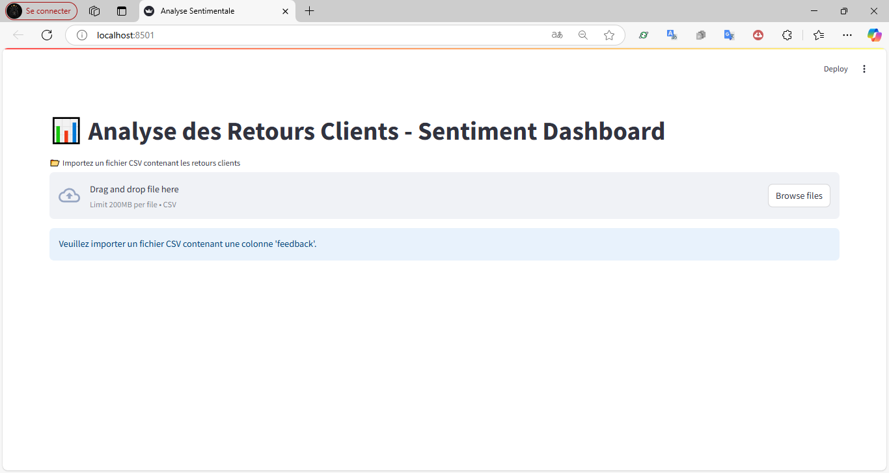
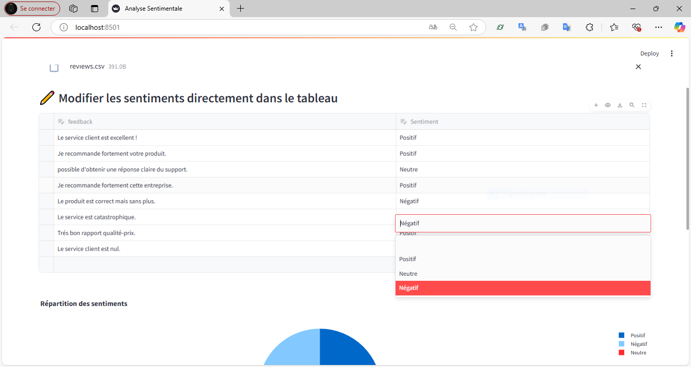
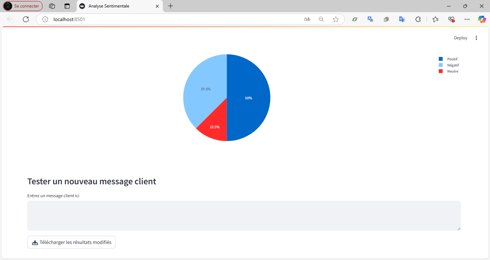

# Sentiment Analysis Dashboard

Analyse automatique des sentiments des retours clients avec VADER et Streamlit.

## Fonctionnalités
- Import de fichiers CSV
- Analyse en temps réel
- Visualisation interactive
- Export des résultats

## Technologies
- Python, Streamlit
- VADER, Pandas
- Plotly

## Captures d'écran
<div align="center">
  
  
  
</div>

## Installation
```bash
git clone 
pip install -r requirements.txt
streamlit run app.py
ou
python -m streamlit run app.py


